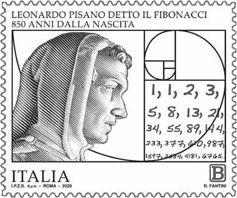

De <a href="https://nl.wikipedia.org/wiki/Rij_van_Fibonacci" target="_blank">rij van Fibonacci</a>, genoemd naar de Italiaanse wiskundige Fibonacci, ook gekend als <a href="https://nl.wikipedia.org/wiki/Fibonacci" target="_blank">Leonardo van Pisa</a>, is een opeenvolging van natuurlijke getallen die aan een bepaald patroon voldoen. Elk getal is de som van de vorige twee getallen. In deze oefening starten we met rangnummer 0 en 1, die allebei de waarde 1 krijgen.

{:data-caption="Een Italiaanse postzegel met een tekening van Fibonacci." width="30%"}

Je kan dit wiskundig noteren met een **recursief** voorschrift:

```text
u_0 = 1
u_1 = 1
u_n = u_(n - 1) + u_(n - 2)
```

De rij begint dus als volgt:

```text
1, 1, 2, 3, 5, 8, 13, 21, 34, ...
```

## Gevraagd
Schrijf een programma dat een rangnummer `n` aan de gebruiker vraagt. Daarna berekent je programma het n<sup>de</sup> getal in de rij van Fibonacci en toont het dit op het scherm.

#### Voorbeelden

Bij invoer `2` verschijnt:
```
Het getal uit de rij van Fibonacci met rangnummer 2 is 2
```

Bij invoer `8` verschijnt:
```
Het getal uit de rij van Fibonacci met rangnummer 8 is 34
```
